# OCR长图智能处理系统 - 完整流程图文档

> 本文档详细记录OCR长图智能处理系统的完整技术流程，适合新手快速理解和开发者维护使用。

## 🎯 项目整体流程图

```mermaid
flowchart TD
    Start([用户输入长聊天截图<br/>支持: PNG、JPG、JPEG]) --> Init[初始化系统<br/>LongImageOCR类]
    
    Init --> LoadConfig[加载配置<br/>Config类 - dataclass<br/>包含: OCR/图像/头像/内容/输出配置]
    
    LoadConfig --> InitComponents[初始化7大核心组件<br/>每个组件独立职责]
    
    InitComponents --> Components[
        ImageSlicer - 图像切片器<br/>
        OCREngine - OCR引擎封装RapidOCR<br/>
        AvatarDetector - 头像检测器<br/>
        ContentMarker - 内容标记器<br/>
        Deduplicator - 去重处理器<br/>
        ChatAnalyzer - 聊天分析器<br/>
        JsonExporter - JSON导出器
    ]
    
    Components --> Step1[🔪 步骤1: 图像切片<br/>ImageSlicer图像切片方法]
    
    Step1 --> SliceDetail[
        切片参数:<br/>
        - 切片高度: 1200px<br/>
        - 重叠区域: 200px<br/>
        - 生成SliceInfo对象列表<br/>
        - 保存切片图像到输出目录
    ]
    
    SliceDetail --> Step2[🎯 步骤2: 计算x_crop值<br/>AvatarDetector计算横向裁剪值]
    
    %% 图像读取异常处理
    Step1 -.->|图像读取失败| ImageReadError[
        图像读取异常:<br/>
        - 检查文件是否存在<br/>
        - 验证文件格式<br/>
        - 记录错误日志<br/>
        - 抛出ValueError异常
    ]
    ImageReadError --> End
    
    Step2 --> XCropDetail[
        x_crop计算流程:<br/>
        1. 选择要处理的切片:<br/>
        　　- 总共1片: 处理这1片<br/>
        　　- 总共2片: 只处理第1片<br/>
        　　- 3片及以上: 处理所有中间切片，跳过首尾<br/>
        2. 每片查找目标框:<br/>
        　　- 图像预处理: 灰度化→高斯模糊5x5→二值化230→反转<br/>
        　　- 提取轮廓找矩形框<br/>
        　　- 筛选正方形: 宽高比0.9-1.1<br/>
        3. 选择最佳框的算法:<br/>
        　　- 所有框按x坐标排序<br/>
        　　- 取最左侧20%的框<br/>
        　　- 找第一个严格正方形: 宽高比0.8-1.2<br/>
        4. 计算x_crop = x + w + 3像素偏移<br/>
        用途: 确定头像检测的横向边界，避免误识别
    ]
    
    XCropDetail --> Step3[🔄 步骤3: 并行处理切片<br/>_process_slices]
    
    Step3 --> ProcessLoop{遍历每个切片<br/>逐个独立处理}
    
    ProcessLoop --> OCRProcess[
        📝 OCR识别<br/>
        OCREngine.process_slice<br/>
        - 针对当前切片图像进行OCR<br/>
        - 调用RapidOCR引擎<br/>
        - 返回OCRItem列表<br/>
        - 包含: text/box/score<br/>
        - 坐标自动转换为原图坐标
    ]
    
    OCRProcess --> AvatarCrop[
        👤 头像步骤1: 图像裁剪<br/>
        - 如果有x_crop: 裁剪到0到x_crop<br/>
        - 否则: 使用完整切片宽度<br/>
        目的: 只在头像可能出现的区域检测
    ]
    
    %% OCR识别异常处理
    OCRProcess -.->|OCR引擎失败| OCRError[
        OCR识别异常:<br/>
        - 记录识别失败的切片<br/>
        - 返回空OCR结果<br/>
        - 继续处理下一切片<br/>
        - 不中断整体流程
    ]
    OCRError --> AvatarCrop
    
    AvatarCrop --> AvatarPreprocess[
        👤 头像步骤2: 图像预处理<br/>
        1. BGR → 灰度图<br/>
        2. 高斯模糊 5x5核 去噪<br/>
        3. 二值化 阈值230<br/>
        4. 颜色反转 白黑互换<br/>
        原因: 头像通常是深色背景浅色边框
    ]
    
    AvatarPreprocess --> AvatarExtract[
        👤 头像步骤3: 轮廓提取<br/>
        1. findContours 提取外轮廓<br/>
        2. boundingRect 计算外接矩形<br/>
        3. 按面积降序排序<br/>
        大框优先处理
    ]
    
    AvatarExtract --> AvatarNMS[
        👤 头像步骤4: 非最大抑制<br/>
        - 遍历所有矩形框<br/>
        - 计算IOU 交并比<br/>
        - IOU > 0.0 则去除<br/>
        关键: 阈值为0意味着完全不允许重叠
    ]
    
    AvatarNMS --> AvatarMergeCalc[
        👤 头像步骤5: 计算合并阈值<br/>
        - 找到最大框 第一个<br/>
        - 取最长边 宽度或高度的最大值<br/>
        - 阈值等于最长边长度<br/>
        自适应: 根据图像尺寸动态调整
    ]
    
    AvatarMergeCalc --> AvatarMerge[
        👤 头像步骤6: 合并相邻框<br/>
        1. 判断是否应合并:<br/>
        - 中心点距离 < 阈值 OR<br/>
        - IOU > 0.01<br/>
        2. 分组合并:<br/>
        - 将相邻框分为一组<br/>
        - 计算组的最小外接框
    ]
    
    AvatarMerge --> AvatarConvert[
        👤 头像步骤7: 坐标转换<br/>
        - 切片坐标 → 原图坐标<br/>
        - Y坐标转换为原图坐标系<br/>
        - 创建AvatarItem对象<br/>
        - 记录切片索引
    ]
    
    AvatarConvert --> AvatarDebug[
        👤 头像步骤8: 调试输出<br/>
        - 保存到调试目录<br/>
        - 绘制检测到的矩形框<br/>
        - 用于验证检测效果
    ]
    
    AvatarDebug --> CollectResults[
        收集结果:<br/>
        所有OCR项收集完成<br/>
        所有头像项收集完成<br/>
        坐标已转换为原图坐标系
    ]
    
    %% 头像检测异常处理
    AvatarPreprocess -.->|图像处理失败| AvatarError[
        头像检测异常:<br/>
        - 图像预处理失败<br/>
        - 记录错误信息<br/>
        - 返回空头像列表<br/>
        - 继续OCR内容处理
    ]
    AvatarError --> CollectResults
    
    CollectResults --> NextSlice{还有切片?}
    NextSlice -->|是| ProcessLoop
    NextSlice -->|否| Step4[🔁 步骤4: 去重处理<br/>Deduplicator.deduplicate]
    
    Step4 --> DedupDetail[
        去重算法详解:<br/>
        🔹 OCR文本去重:<br/>
        　1. 遍历所有OCR项<br/>
        　2. 计算IOU交并比 阈值0.65<br/>
        　3. 重复时保留score更高的项<br/>
        🔹 头像位置去重:<br/>
        　1. 遍历所有头像项<br/>
        　2. 计算IOU交并比 阈值0.0严格<br/>
        　3. 重复时保留面积更大的头像<br/>
        🔹 IOU计算公式:<br/>
        　交集面积 / 并集面积<br/>
        目的: 消除切片重叠区域的重复识别
    ]
    
    DedupDetail --> PlatformDetect[🔍 平台检测<br/>_detect_and_print_platform_type]
    
    PlatformDetect --> DetectLogic[
        平台检测详细流程:<br/>
        1. 🔍 关键词搜索:<br/>
        　　- 搜索关键词: 飞书/Feishu/Lark<br/>
        　　- 遍历所有OCR识别文本<br/>
        　　- 记录关键词出现位置<br/>
        2. 📊 检测判断:<br/>
        　　- 所有关键词都找到 → 飞书模式<br/>
        　　- 缺少任一关键词 → 通用模式：微信绿色、蓝信蓝色、钉钉蓝色<br/>
        3. 📝 详细日志输出:<br/>
        　　- 关键词检测结果详情<br/>
        　　- 最终平台类型判断
    ]
    
    DetectLogic --> PlatformBranch{平台类型?}
    PlatformBranch -->|飞书模式| FeishuPath[🚀 飞书专用处理路径]
    PlatformBranch -->|通用模式| CommonPath[🔧 通用处理路径-微信蓝信钉钉]
    
    CommonPath --> CommonStep5[🏷️ 步骤5A: 通用模式内容标记<br/>ContentMarker.mark_content]
    FeishuPath --> FeishuStep5[🏷️ 步骤5B: 飞书模式内容标记<br/>ContentMarker.mark_content]
    
    CommonStep5 --> CommonTimeMarking[
        ⏰ 5A.1 时间标记（通用）:<br/>
        📋 匹配条件:<br/>
        　- 文本长度 ≤ 30字符<br/>
        　- 排除关键词: 撤回/红包等<br/>
        📐 正则模式:<br/>
        　- 年月日: 数字年月日格式<br/>
        　- 时分秒: 数字时分秒格式<br/>
        　- 相对时间: 昨天/今天/前天<br/>
        　- 时间段: 上午/下午/晚上<br/>
        📊 匹配率阈值:<br/>
        　- 复合时间格式: ≥0.4<br/>
        　- 完整日期格式: ≥0.7<br/>
        　- 简单时间格式: ≥0.6
    ]
    
    FeishuStep5 --> FeishuTimeMarking[
        ⏰ 5B.1 时间标记（飞书）:<br/>
        🔄 处理流程与通用模式相同<br/>
        📐 使用相同的正则模式<br/>
        📊 使用相同的匹配率阈值
    ]
    
    CommonTimeMarking --> CommonNickname[
        👤 5A.2 通用模式昵称处理:<br/>
        🔍 昵称识别策略:<br/>
        　1. 遍历每个头像位置<br/>
        　2. 在头像Y坐标范围内查找文本<br/>
        　3. 昵称过滤条件:<br/>
        　　　- 长度 ≤ 20字符<br/>
        　　　- 不含句号、逗号等标点<br/>
        　　　- 不以动词开头如: 不是、没有等<br/>
        　　　- 非完整句子特征<br/>
        💾 虚拟昵称创建:<br/>
        　- 无昵称时创建虚拟昵称: 未知用户N<br/>
        　- 使用头像坐标作为文本框<br/>
        　- 标记为虚拟项
    ]
    
    FeishuTimeMarking --> FeishuSystemMsg[
        💬 5B.2 飞书系统消息标记:<br/>
        🔍 系统消息识别:<br/>
        　- 检测关键词: 撤回/红包/文件等<br/>
        　- 跳过已标记的内容<br/>
        　- 匹配模式: 正则表达式<br/>
        🏷️ 标记方式:<br/>
        　- 在原文本后添加系统消息标记<br/>
        　- 记录标记数量<br/>
        📝 日志输出: 记录处理详情
    ]
    
    FeishuSystemMsg --> FeishuAvatarFilter[
        👤 5B.3 飞书头像过滤:<br/>
        📏 面积计算:<br/>
        　- 计算所有头像的面积<br/>
        　- 求面积均值: 所有面积总和除以数量<br/>
        🔍 过滤策略:<br/>
        　- 保留面积 ≥ 均值的头像<br/>
        　- 过滤装饰性小头像<br/>
        　- 降低误识别风险<br/>
        📊 统计输出:<br/>
        　- 过滤前后头像数量对比<br/>
        　- 日志记录过滤详情
    ]
    
    FeishuAvatarFilter --> FeishuNickname[
        👤 5B.4 飞书昵称合并:<br/>
        🔄 昵称收集:<br/>
        　1. 遍历过滤后的头像<br/>
        　2. 收集头像Y范围内所有文本<br/>
        　3. 跳过时间和系统消息<br/>
        🔗 昵称合并:<br/>
        　- 多段文本用空格连接<br/>
        　- 第一项保留，其余删除<br/>
        　- 添加昵称标记<br/>
        💾 虚拟昵称:<br/>
        　- 无昵称时创建虚拟昵称: 未知用户N<br/>
        　- 计算正确的插入位置
    ]
    
    CommonNickname --> CommonContentMark[
        📝 5A.3 通用内容标记:<br/>
        🔍 内容定位:<br/>
        　1. 找到每个昵称位置<br/>
        　2. 标记昵称后的文本为内容<br/>
        　3. 边界条件: 不超过下个头像区域<br/>
        📊 标记条件:<br/>
        　- 内容Y坐标 > 头像Y坐标<br/>
        　- 内容Y坐标 < 下个头像Y坐标<br/>
        　- 跳过已标记项: 时间、昵称等<br/>
        🏷️ 标记方式:<br/>
        　- 在原文本后添加内容标记
    ]
    
    FeishuNickname --> FeishuContentMark[
        📝 5B.5 飞书内容标记:<br/>
        🔄 处理流程与通用模式相同<br/>
        📊 使用相同的标记条件<br/>
        🏷️ 使用相同的标记方式
    ]
    
    CommonContentMark --> ColorDetection[
        🎨 5A.4 颜色检测标记我的内容:<br/>
        🔍 绿色检测-微信:<br/>
        　- HSV范围: H色相35-85 S饱和度40-255 V明度40-255<br/>
        　- 绿色像素比例阈值: >0.2<br/>
        　- 转换BGR→HSV色彩空间<br/>
        　- 计算绿色掩码区域<br/>
        🔍 蓝色检测-蓝信钉钉:<br/>
        　- HSV范围: H色相100-130 S饱和度30-180 V明度80-255<br/>
        　- 蓝色像素比例阈值: >0.3<br/>
        　- 白色背景过滤: H色相0-180 S饱和度0-30 V明度200-255<br/>
        　- 判断逻辑: 蓝色超过阈值 且 白色低于0.5 且 蓝色大于白色<br/>
        🔄 位置推理:<br/>
        　1. 找到已标记的我的内容<br/>
        　2. 检查相邻内容框<br/>
        　3. 头像边界约束验证<br/>
        　4. 连续标记相邻内容
    ]
    
    FeishuContentMark --> SkipColorDetection[
        ⏭️ 5B.6 跳过颜色检测:<br/>
        🚫 飞书平台特殊处理:<br/>
        　- 不进行绿色/蓝色背景检测<br/>
        　- 跳过我的内容颜色标记<br/>
        　- 直接进入下一步骤<br/>
        📝 日志记录: 飞书平台跳过颜色检测
    ]
    
    ColorDetection --> Step6[💬 步骤6: 聊天分析<br/>ChatAnalyzer.analyze]
    SkipColorDetection --> Step6
    
    %% 颜色检测异常处理
    ColorDetection -.->|颜色空间转换失败| ColorError[
        颜色检测异常:<br/>
        - HSV转换失败<br/>
        - 图像区域无效<br/>
        - 降级为普通内容<br/>
        - 记录调试信息<br/>
        - 不影响主流程
    ]
    ColorError --> Step6
    
    Step6 --> AnalyzeDetail[
        分析过程:<br/>
        1. 创建ChatSession对象<br/>
        2. 遍历标记项构建消息<br/>
        3. 消息类型分类:<br/>
           - chat: 普通聊天<br/>
           - time: 时间节点<br/>
           - group_name: 群名<br/>
           - system_message: 系统消息<br/>
        4. 组装结构化聊天记录
    ]
    
    AnalyzeDetail --> Step7[💾 步骤7: 导出结果<br/>JsonExporter.export]
    
    Step7 --> ExportFiles[
        输出文件 3个JSON:<br/>
        📄 标记后的OCR结果文件<br/>
        - 所有OCR项+标记类型<br/>
        📄 结构化聊天消息文件<br/>
        - 结构化聊天消息列表<br/>
        📄 处理摘要数据文件<br/>
        - 处理统计: 项数/时间等
    ]
    
    ExportFiles --> Visualization[
        🎨 可视化输出<br/>
        Visualizer.create_process_summary<br/>
        - 切片图像文件<br/>
        - OCR可视化文件<br/>
        - 头像调试图文件<br/>
        - 处理总结图文件
    ]
    
    %% 导出异常处理
    Step7 -.->|文件写入失败| ExportError[
        导出异常:<br/>
        - JSON文件写入失败<br/>
        - 目录权限不足<br/>
        - 磁盘空间不足<br/>
        - 记录错误但继续<br/>
        - 尝试备用路径
    ]
    ExportError --> Visualization
    
    Visualization --> Complete[✅ 处理完成<br/>返回结果摘要字典]
    
    Complete --> LLMIntegration{启用LLM问答?}
    
    LLMIntegration -->|是| OllamaAPI[
        🤖 Ollama本地大模型<br/>
        - API端口 11434<br/>
        - 模型 qwen3-8b<br/>
        - 输入: 结构化聊天记录<br/>
        - 功能: 智能问答/信息提取
    ]
    
    OllamaAPI --> QALoop[
        问答循环:<br/>
        1. 用户提问<br/>
        2. 分析聊天记录<br/>
        3. 结构化引用<br/>
        4. 生成回答总结
    ]
    
    QALoop --> End([结束])
    LLMIntegration -->|否| End
    
    %% 错误处理路径
    Step1 -.->|异常| ErrorHandler[
        异常处理:<br/>
        - 记录详细日志<br/>
        - 保存调试信息<br/>
        - 抛出异常给调用方
    ]
    ErrorHandler --> End
    
    %% 样式定义
    classDef stepBox fill:#e3f2fd,stroke:#1976d2,stroke-width:2px
    classDef detailBox fill:#f3e5f5,stroke:#7b1fa2,stroke-width:1px
    classDef decisionBox fill:#fff3e0,stroke:#f57c00,stroke-width:2px
    classDef outputBox fill:#e8f5e9,stroke:#388e3c,stroke-width:2px
    classDef commonModeBox fill:#e8f5e8,stroke:#4caf50,stroke-width:2px
    classDef feishuModeBox fill:#e3f2fd,stroke:#2196f3,stroke-width:2px
    
    class Step1,Step2,Step3,Step4,Step6,Step7 stepBox
    class SliceDetail,XCropDetail,DedupDetail,DetectLogic,AnalyzeDetail detailBox
    class PlatformBranch,LLMIntegration,NextSlice decisionBox
    class ExportFiles,Visualization,Complete outputBox
    class AvatarCrop,AvatarPreprocess,AvatarExtract,AvatarNMS,AvatarMergeCalc,AvatarMerge,AvatarConvert,AvatarDebug stepBox
    class CommonPath,CommonStep5,CommonTimeMarking,CommonNickname,CommonContentMark,ColorDetection commonModeBox
    class FeishuPath,FeishuStep5,FeishuTimeMarking,FeishuSystemMsg,FeishuAvatarFilter,FeishuNickname,FeishuContentMark,SkipColorDetection feishuModeBox
    
    %% 异常处理样式
    classDef errorBox fill:#ffebee,stroke:#d32f2f,stroke-width:2px,stroke-dasharray: 5 5
    class ImageReadError,OCRError,AvatarError,ColorError,ExportError,ErrorHandler errorBox
```



## 📊 关键参数配置表

### 🔧 图像处理参数

| 参数名 | 默认值 | 作用 | 源码位置 | 调优建议 |
|--------|--------|------|----------|----------|
| **slice_height** | 1200 | 每片切片的高度(像素) | ImageConfig | 图像分辨率高时可适当增大 |
| **overlap** | 200 | 切片重叠区域高度(像素) | ImageConfig | 确保文字不被截断，通常为slice_height的1/6 |
| **binary_threshold** | 230 | 二值化阈值(0-255) | ImageConfig | 图像偏暗时降低，偏亮时提高 |
| **gaussian_blur_size** | (5,5) | 高斯模糊核大小 | ImageConfig | 噪声多时增大，如(7,7) |

### 👤 头像检测参数

| 参数名 | 默认值 | 作用 | 源码位置 | 调优建议 |
|--------|--------|------|----------|----------|
| **square_ratio_min/max** | 0.9/1.1 | 初筛正方形宽高比范围 | AvatarConfig | 头像形状偏圆时可调整为0.8/1.2 |
| **strict_square_ratio_min/max** | 0.8/1.2 | 最终选择时的宽高比范围 | AvatarConfig | 比初筛更宽松，适应边框变形 |
| **iou_threshold** | 0.0 | NMS重叠阈值 | AvatarConfig | 设为0确保头像无重叠 |
| **x_crop_offset** | 3 | x_crop额外偏移(像素) | AvatarConfig | 确保完整包含头像边界 |
| **merge_distance_factor** | 1.0 | 合并距离系数 | ImageConfig | 增大会合并更远的框 |

### 📝 OCR识别参数

| 参数名 | 默认值 | 作用 | 源码位置 | 调优建议 |
|--------|--------|------|----------|----------|
| **text_score_threshold** | 0.65 | OCR文本置信度阈值 | OCRConfig | 识别率低时降低，误识别多时提高 |
| **config_path** | "default_rapidocr.yaml" | RapidOCR配置文件路径 | OCRConfig | 根据需要切换不同OCR配置 |

### 🔁 去重处理参数

| 参数名 | 默认值 | 作用 | 源码位置 | 调优建议 |
|--------|--------|------|----------|----------|
| **ocr_iou_threshold** | 0.65 | OCR重复判定IOU阈值 | DeduplicationConfig | 重复过多时提高，漏检时降低 |
| **avatar_iou_threshold** | 0.0 | 头像重复判定IOU阈值 | DeduplicationConfig | 0表示严格不重叠，一般不调整 |

### 🏷️ 内容标记参数

| 参数名 | 默认值 | 作用 | 源码位置 | 调优建议 |
|--------|--------|------|----------|----------|
| **green_hsv_lower/upper** | (35,40,40)/(85,255,255) | 绿色HSV检测范围 | ContentConfig | 根据界面绿色调整色相 |
| **blue_hsv_lower/upper** | (100,30,80)/(130,180,255) | 蓝色HSV检测范围 | ContentConfig | 根据界面蓝色调整色相 |
| **white_hsv_lower/upper** | (0,0,200)/(180,30,255) | 白色HSV检测范围 | ContentConfig | 白色背景过滤参数 |
| **green_ratio_threshold** | 0.2 | 绿色像素比例阈值 | ContentConfig | 检测敏感度调整 |
| **blue_ratio_threshold** | 0.3 | 蓝色像素比例阈值 | ContentConfig | 检测敏感度调整 |
| **white_ratio_threshold** | 0.5 | 白色像素比例阈值 | ContentConfig | 背景干扰过滤 |

### 📁 输出配置参数

| 参数名 | 默认值 | 作用 | 源码位置 | 调优建议 |
|--------|--------|------|----------|----------|
| **output_images_dir** | "output_images" | 图像输出目录 | OutputConfig | 根据项目结构调整 |
| **output_json_dir** | "output_json" | JSON输出目录 | OutputConfig | 根据项目结构调整 |
| **debug_dir** | "output_images/debug" | 调试图像目录 | OutputConfig | 开发时启用，生产时可禁用 |

## 💡 关键技术要点说明

### 🎯 **对新手特别重要的概念**

#### **1. x_crop值的核心作用**
```
x_crop = 最左侧头像框的右边界 + 3像素偏移
```
- **定义**: 头像检测的横向边界线
- **作用**: 将图像裁剪为只包含头像区域，避免将聊天内容中的图片误识别为头像
- **传递**: 一次计算，全局使用 - 所有切片的头像检测都使用这个值
- **优势**: 大幅提高检测准确性，减少误识别

#### **2. 基于切片的OCR处理**
```
切片1: [0, 1200]     → OCR识别 → 坐标转换为原图
切片2: [1000, 2200]  → OCR识别 → 坐标转换为原图 
切片3: [2000, 3200]  → OCR识别 → 坐标转换为原图
```
- **独立处理**: 每个切片单独进行OCR识别，避免长图处理失败
- **重叠策略**: 200px重叠区域防止文字被截断
- **坐标转换**: 切片坐标自动转换为原图坐标系
- **去重处理**: 通过坐标比较和内容匹配去除重复识别

#### **3. 智能去重算法**
```
OCR去重: IOU > 0.65 → 保留score更高的项
头像去重: IOU > 0.0 → 保留面积更大的框
IOU计算: 交集面积 / 并集面积
```
- **差异化策略**: OCR允许部分重叠(0.65)，头像严格不重叠(0.0)
- **选择原则**: OCR按置信度优先，头像按面积优先
- **处理时机**: 所有切片处理完成后统一去重
- **关键作用**: 消除200px重叠区域的重复识别

#### **4. 平台检测的智能策略**
- **检测时机**: 在OCR完成后基于文本内容判断
- **检测方法**: 关键词匹配 + 出现频率统计
- **两种模式**: 飞书专用模式 vs 微信/蓝信/钉钉通用模式
- **影响范围**: 决定使用哪种内容标记策略
- **关键词示例**: 飞书、Feishu、Lark、消息已撤回等

#### **5. 智能内容标记系统**
```
时间标记 → 系统消息 → 昵称定位 → 内容关联 → 颜色检测
   ↓         ↓         ↓         ↓         ↓
 正则匹配   飞书专用   Y坐标范围  头像边界   HSV分析
```
- **分层标记**: 按优先级逐步标记不同类型内容
- **双模式策略**: 飞书模式专注昵称合并，通用模式重视颜色检测
- **智能推理**: 基于已标记内容的位置关系推理相邻内容
- **虚拟昵称**: 无昵称时自动创建"未知用户N"保持结构完整

#### **6. 多层过滤的头像检测**
```
轮廓提取 → NMS去重 → 相邻合并 → 正方形筛选
   ↓         ↓        ↓         ↓
 所有框   去除重叠  合并碎片   保留头像
```
- **层层递进**: 每一层都减少误检，提高精度
- **自适应**: 合并阈值根据图像尺寸动态调整
- **鲁棒性**: 适应不同分辨率和界面风格

#### **7. dataclass设计的优势**
```python
@dataclass
class OCRItem:
    text: str
    box: Tuple[float, float, float, float]
    score: float
    type: str = "unknown"
```
- **类型安全**: IDE智能提示，减少运行时错误
- **自动功能**: 自动生成__init__, __repr__, __eq__等方法
- **序列化**: 轻松转换为JSON格式
- **可维护**: 结构清晰，易于扩展

### 🔧 **架构设计亮点**

#### **1. Pipeline模式**
```
输入 → 组件A → 组件B → 组件C → 输出
```
- **单向数据流**: 每个组件的输出是下个组件的输入
- **职责单一**: 每个组件只负责一个特定功能
- **易于测试**: 可以独立测试每个组件
- **易于扩展**: 可以轻松添加新的处理步骤

#### **2. 依赖注入**
```python
def __init__(self, config: Config):
    self.config = config
    self.image_slicer = ImageSlicer(config)
    self.ocr_engine = OCREngine(config)
```
- **消除全局变量**: 所有配置通过参数传递
- **提高可测试性**: 可以注入mock对象进行测试
- **配置集中**: 所有配置在Config类中统一管理

#### **3. 错误处理策略**
```python
try:
    # 主要处理逻辑
except Exception as e:
    logger.error(f"处理过程中出现错误: {e}", exc_info=True)
    raise
```
- **异常传播**: 不隐藏错误，向上抛出
- **详细日志**: 记录完整的错误堆栈
- **用户友好**: 提供清晰的错误信息

### 🚀 **性能优化点**

#### **1. 内存管理**
- 切片处理完立即释放内存
- 只保留必要的中间结果
- 大图像采用流式处理

#### **2. 计算优化**
- x_crop值一次计算，重复使用
- 按面积排序，优先处理大框
- NMS算法减少不必要的比较

#### **3. I/O优化**
- 批量保存调试图像
- JSON文件一次性写入
- 异步处理可视化输出

### 🔍 **调试技巧**

#### **1. 可视化调试**
- `slice_*.jpg`: 查看切片效果
- `avatars_slice_*.jpg`: 检查头像检测结果
- `slice_ocr_result_*.jpg`: 验证OCR识别准确性

#### **2. 日志分析**
```
INFO - 步骤1: 切分图像...
INFO - 计算得到的x_crop值: 156
INFO - 切片 0 检测到 3 个头像
```
- 每个步骤都有明确的日志输出
- 关键数值都会被记录
- 便于定位问题和性能分析

#### **3. 参数调优**
- 从二值化阈值开始调整
- 观察头像检测的召回率和精确率
- 根据实际数据调整平台检测关键词

### 🌟 **扩展建议**

#### **1. 新平台支持**
- 在`ContentConfig`中添加新的颜色检测参数
- 在`ContentMarker`中实现新的标记策略
- 更新平台检测关键词

#### **2. 性能提升**
- 引入GPU加速的OCR引擎
- 实现多线程并行处理切片
- 添加智能缓存机制

#### **3. 功能增强**
- 支持语音消息的时长识别
- 添加表情包和图片消息的处理
- 实现聊天记录的语义分析

---

## 📚 文档更新说明

- **创建时间**: 2025年1月
- **文档版本**: v1.0
- **适用范围**: OCR长图智能处理系统 (重构版)
- **维护方式**: 根据需求随时更新流程图和参数说明

### 📝 **使用说明**
1. **复制流程图**: 直接复制Mermaid代码块，可在支持Mermaid的工具中渲染
2. **参数调优**: 参考参数表格中的调优建议，根据实际数据调整
3. **问题定位**: 结合日志输出和可视化调试图像分析问题
4. **功能扩展**: 基于架构设计亮点，按照现有模式添加新功能

### 🔄 **后续更新计划**
- 根据用户反馈更新流程图细节
- 添加更多平台的适配策略
- 补充性能优化的具体实现方案
- 增加常见问题的解决方案